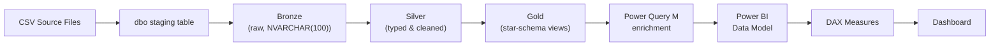

# NYC Airbnb Listing Intelligence (2025–2026)

End-to-end data analytics project covering **SQL Server ETL (Bronze → Silver → Gold)**, **dimensional data modeling**, and an interactive **Power BI dashboard** built on 30,260 NYC Airbnb listings.


---

## Table of Contents

- [Project Overview](#project-overview)
- [Business Problem](#business-problem)
- [Tech Stack](#tech-stack)
- [Repository Structure](#repository-structure)
- [Architecture: Bronze → Silver → Gold](#architecture-bronze--silver--gold)
- [Data Model (Star Schema)](#data-model-star-schema)
- [Dataset](#dataset)
- [Power BI Dashboard](#power-bi-dashboard)
- [Key Insights](#key-insights)
- [DAX Highlights](#dax-highlights)
- [How to Reproduce](#how-to-reproduce)
- [Skills Demonstrated](#skills-demonstrated)
- [Known Limitations](#known-limitations)
- [Future Enhancements](#future-enhancements)
- [Author](#author)

---

## Project Overview

This project transforms a raw NYC Airbnb listings export into a business-ready analytics product. It implements a three-layer SQL Server warehouse (**Bronze → Silver → Gold**) that cleans, types, and restructures the raw data into a star schema, then layers a **Power BI dashboard** with DAX measures on top for interactive analysis across four pages: **Overview, Host, Room, and Rating**.

The dataset spans **30,260 listings** across the five NYC boroughs, generating **$389M** in estimated revenue at an average occupancy of **14.4%** and an average guest rating of **4.77 / 5**.

## Business Problem

NYC Airbnb listing data is fragmented across host attributes, property characteristics, bathroom configuration, availability windows, review activity, and pricing — making it difficult to answer basic marketplace questions:

- Which boroughs and room types generate the most revenue?
- How concentrated is supply among hosts?
- How does availability vary by segment, and what does that suggest about demand?
- Is guest satisfaction consistent across the market?

This project consolidates those fragmented sources into a single dimensional model and dashboard that a marketplace, host-success, or operations team could use to monitor and act on performance.

## Tech Stack

| Layer | Tool |
|---|---|
| Data warehouse | Microsoft SQL Server (T-SQL) |
| ETL / transformation | T-SQL stored procedures, views |
| Data enrichment | Power Query (M) |
| Semantic layer | DAX measures & calculated columns |
| Visualization | Power BI |

## Repository Structure

```
nyc-airbnb-listing-intelligence/
│
├── SQL_Scripts/
│   ├── main/
│   │   └── main_ddl.sql                                  # Creates database + bronze/silver/gold schemas
│   ├── bronze/
│   │   ├── bronze_listing_ddl.sql                         # Raw staging table (all NVARCHAR)
│   │   └── bronze_nyc_airbnb_listing_stored_procedure.sql # Loads dbo → bronze
│   ├── silver/
│   │   ├── silver_listing_ddl.sql                         # Typed, cleaned table
│   │   └── silver_listing_stored_procedure.sql            # Bronze → Silver transformation logic
│   └── gold/
│       └── gold_stored_procedure.sql                      # Star-schema views (fact + 7 dimensions)
│
├── dax_script/
│   ├── power_query_m_code.m                # Power Query enrichment for gold.dim_host
│   ├── dax_measures_columns_script.txt     # ~35 DAX measures + 2 calculated columns
│   └── readme
│
├── data_model/
│   └── star_schema_diagram.jpg             # Power BI model view
│
├── dashboard/
│   └── NYC_Airbnb_DA.pdf                   # Exported dashboard (4 pages)
│
├── gold_layer_exports/                     # Gold-layer tables exported to Excel
│   ├── gold_fact_listing.xlsx
│   ├── gold_dim_host.xlsx
│   ├── gold_dim_location.xlsx
│   ├── gold_dim_room.xlsx
│   ├── gold_dim_bathroom.xlsx
│   ├── gold_dim_availability.xlsx
│   ├── gold_dim_review.xlsx
│   └── gold_dim_date.xlsx
│
├── reports/
│   └── NYC_Airbnb_Data_Analysis_Report.docx   # Full write-up: methodology, dashboard analysis, insights
│
└── README.md
```

> Adjust folder names above to match your actual repo layout before pushing.

## Architecture: Bronze → Silver → Gold



**Bronze** — raw CSVs are loaded into a `dbo` staging table in SQL Server, then copied into `bronze.NYC_airbnb_listing` with every column stored as `NVARCHAR(100)` via `TRY_CAST`, preserving original values with no type enforcement.

**Silver** — `silver.load_silver` truncates and reloads the table from Bronze, applying:
- `TRY_CAST` / `TRY_CONVERT` with `NULLIF` for null handling
- A surrogate key, `ListingKey`, generated via `ROW_NUMBER() OVER (ORDER BY id, host_id)`
- Host tenure derivation: `(years × 12) + months` → `TotalUserMonths` / `TotalHostMonths`
- Bathroom text parsing: splitting `bathrooms_text` into `bathrooms_count` and `bathroomtype` using pattern matching, defaulting to `'Unknown'`
- Price cleaning: stripping `$` and `,` before casting to `DECIMAL(15,2)`
- Precision standardization: lat/long rounded to 6 decimals, ratings to 1 decimal

**Gold** — `gold_stored_procedure.sql` defines one view per dimension plus the fact table, all selecting from `silver.NYC_airbnb_listing`:
- Boolean flags (`t`/`f`) standardized to `1`/`0` (`IsSuperhost`, `IsIdentityVerified`, `HasAvailability`)
- Beds imputation with a quality flag (`Original` / `Estimated` / `Adjusted`)
- Bathroom categorization into `Private` / `Shared` / `Unknown` privacy and `Half` / `Full` / `Unknown` category

**Power Query (M)** — further enriches `gold.dim_host` with human-readable status columns (`Superhost Status`, `Identity Verification Status`) and a `Host Portfolio` segmentation (`Single-Listing` / `Small` / `Medium` / `Large`, based on `TotalListings` thresholds).

## Data Model (Star Schema)


`gold.fact_listing` is related **1:1 on `ListingKey`** to all seven gold dimension views — `dim_host`, `dim_review`, `dim_bathroom`, `dim_room`, `dim_location`, `dim_availability`, and `dim_date` — each holding the same 30,260-row listing grain as the fact table. The `dim_room` relationship is configured with bidirectional cross-filtering; the rest use the default single direction. Two disconnected calculated tables (`Key Measures`, `Availability Horizon`) and a hidden `Measure_Table` organize the DAX layer. All primary/foreign keys are hidden from the report view.

| Table | Grain | Purpose |
|---|---|---|
| `gold.fact_listing` | 1 row / `ListingKey` | Price, estimated revenue, occupancy, availability windows, review counts, rating sub-scores |
| `gold.dim_host` | 1 row / `ListingKey` | Host ID/name, Superhost & verification flags, portfolio counts, tenure |
| `gold.dim_location` | 1 row / `ListingKey` | Borough, neighborhood, latitude/longitude |
| `gold.dim_room` | 1 row / `ListingKey` | Room type, capacity, bedrooms, beds, bed-data-quality flag |
| `gold.dim_bathroom` | 1 row / `ListingKey` | Bathroom type, count, privacy, category |
| `gold.dim_availability` | 1 row / `ListingKey` | `HasAvailability`, `AvailYearEnd` |
| `gold.dim_review` | 1 row / `ListingKey` | `FirstReview`, `LastReview` |
| `gold.dim_date` | 1 row / `ListingKey` | Price-quote check-in/check-out window |

## Dataset

- **30,260** listings across the five NYC boroughs
- Single time-snapshot extract (2025–2026), not a historical time series
- Source: [raw CSV files](https://github.com/TCWaghmare/NYC-Airbnb-Marketplace-Intelligence-Dashboard/blob/main/datasets/raw_data/NYC_Airbnb_Listing_Raw.csv) loaded into a SQL Server `dbo` staging schema (upstream export vintage not tracked in this repo)
- [Filterd Data](https://github.com/TCWaghmare/NYC-Airbnb-Marketplace-Intelligence-Dashboard/tree/main/datasets/clean_data)

## Power BI Dashboard

The dashboard has four pages, each with a shared slicer panel (Capacity, Price, Overall Rating, Listing Status, Superhost Status, Borough/Neighborhood, RoomType, BathroomCategory, BathroomPrivacy).

### Overview


Total Estimated Revenue, Revenue per Available listing, Total/Active Listings, Avg Occupancy, Overall Rating; revenue and pricing broken down by borough, room type, and bathroom privacy.

### Host


Total Host, Superhost Rate, Identity Verification, Avg Listings per Host; host tenure segmentation, portfolio concentration, and top-host ranking.

### Room


Availability (30/60/90/365-day), Avg Capacity, Beds per Bedroom; room-type vs. bathroom privacy, bed-data quality, and bathroom distribution.

### Rating


Overall/Value/Location/Communication/Cleanliness/Check-In ratings; review activity status and review frequency by borough.

## Key Insights

- **Manhattan's revenue dominance is price-driven, not volume-driven** — it generates 52.78% of marketplace revenue on an average daily rate of $366, over 70% above the next borough (Brooklyn, $213).
- **The host base is dominated by casual, single-listing hosts** — 71.04% of hosts hold only one listing; the 4.90 average listings-per-host is pulled up by a smaller multi-listing group.
- **"Private room" listings frequently don't have a private bathroom** — 55.5% have a *shared* bathroom, versus only 28.6% private, a naming/expectation gap worth disclosing clearly.
- **Availability and revenue move in opposite directions across boroughs** — Manhattan and Brooklyn (highest revenue) are also the most review-active; Staten Island and Bronx (highest availability) are comparatively low-activity.
- **Superhost status and active engagement are minority conditions** — only 19.8% of hosts are Superhosts and 16.0% of listings are active, despite 98.9% identity verification.

Full visual-by-visual analysis, cross-visual insights, and business recommendations are documented in [`reports/NYC_Airbnb_Data_Analysis_Report.docx`](reports/NYC_Airbnb_Data_Analysis_Report.docx).

## DAX Highlights

```dax
-- Revenue normalized by active supply
Revenue per Available Listing = 
DIVIDE([Total Estimated Revenue], [Active Listing], 0)

-- Host tenure segmentation
Host Tenure Category = 
SWITCH(
    TRUE,
    ISBLANK('gold dim_host'[TotalHostMonths]), "N/A",
    'gold dim_host'[TotalHostMonths] <= 6, "New Host",
    'gold dim_host'[TotalHostMonths] <= 12, "Emerging Host",
    'gold dim_host'[TotalHostMonths] <= 24, "Established Host",
    'gold dim_host'[TotalHostMonths] <= 60, "Experienced Host",
    'gold dim_host'[TotalHostMonths] <= 120, "Long-Term Host",
    "Veteran Host"
)

-- Rating restricted to reasonably-reviewed listings
Avg Overall Rating = 
CALCULATE(AVERAGE('gold fact_listing'[Rating]), 'gold fact_listing'[TotalReviews] >= 5)

-- Composite rating across six sub-categories
Average Rating Across Categories = 
AVERAGEX(
    'gold fact_listing',
    ('gold fact_listing'[ValueRating] + 'gold fact_listing'[AccuracyRating] +
     'gold fact_listing'[CheckInRating] + 'gold fact_listing'[CleanlinessRating] +
     'gold fact_listing'[CommunicationRating] + 'gold fact_listing'[LocationRating]) / 6
)
```

The full measure list (~35 measures, 2 calculated columns) is in [`dax_script/dax_measures_columns_script.txt`](https://github.com/TCWaghmare/NYC-Airbnb-Marketplace-Intelligence-Dashboard/blob/main/dax_script/dax_measures_columns_script.txt).

## How to Reproduce

1. **Set up the database**
   ```sql
   -- Run in order:
   SQL_Scripts/main/main_ddl.sql
   SQL_Scripts/bronze/bronze_listing_ddl.sql
   SQL_Scripts/silver/silver_listing_ddl.sql
   ```
2. **Load raw data** into [`dbo.nyc_airbnb_listing`](https://github.com/TCWaghmare/NYC-Airbnb-Marketplace-Intelligence-Dashboard/tree/main/datasets/clean_data) (your source CSV import step).
3. **Run the ETL procedures** in order:
   ```sql
   EXEC bronze.load_bronze;
   EXEC silver.load_silver;
   ```
4. **Create the gold views**:
   ```sql
   SQL_Scripts/gold/gold_stored_procedure.sql
   ```
5. **Open Power BI**, connect to the `gold` schema views, paste in the Power Query step from [`dax_script/power_query_m_code.m`](https://github.com/TCWaghmare/NYC-Airbnb-Marketplace-Intelligence-Dashboard/blob/main/dax_script/power_query_m_code.m), and add the measures from `dax_script/dax_measures_columns_script.txt`.
6. **Rebuild the four dashboard pages** using the layout shown in [`dashboard/NYC_Airbnb_DA.pdf`](https://github.com/TCWaghmare/NYC-Airbnb-Marketplace-Intelligence-Dashboard/blob/main/PowerBi/Dashboard/NYC%20Airbnb%20Dashboard.pdf).

## Skills Demonstrated

- SQL Server data warehousing (bronze/silver/gold medallion architecture)
- T-SQL: stored procedures, views, `TRY_CAST`/`TRY_CONVERT`, window functions, string parsing
- Dimensional (star schema) data modeling
- Power Query (M): data enrichment, categorization, table transformation
- DAX: measures, calculated columns, `CALCULATE`, `SWITCH`, `RANKX`, dynamic parameter tables
- Power BI dashboard design across four analytical pages
- Data-quality investigation and documentation (see [Known Limitations](#known-limitations))
- Business-facing analytical writing and recommendations

## Known Limitations

- Single time-snapshot dataset — no historical trend analysis.
- `gold.dim_date` reflects a price-quote check-in/check-out window, not actual booking history.
- Availability (calendar openness) is not the same as confirmed occupancy; `EstRevenue` is a modeled figure, not realized revenue.
- A few dashboard KPI cards (e.g., the Host page's `TotalListings` card, `Review Activity Status` logic) don't have an exactly matching named DAX measure in the current script and are flagged for follow-up.

## Future Enhancements

- Price and demand forecasting with multi-period historical data
- Host segmentation via clustering, beyond the current tenure/portfolio rules
- Key Influencers and Decomposition Tree visuals for deeper rating/revenue diagnostics
- External data integration (tourism volume, events, comparable hotel pricing)

## Author

**[Your Name]**
Data Analyst / BI Developer
[LinkedIn](#) · [Portfolio](#) · [Email](#)

---

*If you found this project useful, consider starring the repo.*
